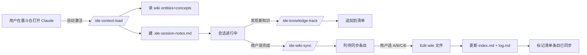

# ide-maintain-plugin

墨斗 IDE 维护辅助 plugin。处理墨斗 IDE 关联仓库（opemindstudio / devicemanager / inktank-* / robot-workstation / three-editor / 等 10 仓）或智能焊接相关任务时，自动加载 `project_wiki` 背景、会话中追踪新发现知识、任务完成时提示同步回 wiki，**形成"加载 → 追踪 → 沉淀"的闭环**。

## 解决什么问题

- ❌ **不用每次新会话从零探索**：进入墨斗 IDE 任务自动加载 wiki entities + concepts
- ❌ **不用人工记得维护 wiki**：会话期间新发现自动进 `.ide-session-notes.md`
- ❌ **不丢失会话沉淀**：任务结束时主动提示同步回 wiki

## Skills

| Skill | 触发 | 作用 |
|---|---|---|
| `/ide-context-load` | 进入墨斗仓 / 智能焊接目录 / 提关键词时自动激活 | 读 `project_wiki/wiki/` 相关条目 + 建会话清单 `.ide-session-notes.md` |
| `/ide-knowledge-track` | 会话期间发现新知识时自动追加 | 追加到 `.ide-session-notes.md` |
| `/ide-wiki-sync` | 用户说"完成" / 切话题 / 显式调用时激活 | 提示用户同步条目回 `project_wiki`（用户选 A/B/C/D/E）|

## 自动触发条件（ide-context-load）

满足任一即自动激活：

1. **cwd 路径**含以下任一仓名：
   - `opemindstudio` / `devicemanager` / `inktank-occ-master` / `inktank-node-occ` / `inktank-kdl`
   - `robot-workstation` / `inktank-core` / `three-editor` / `inktank-master` / `inktank-platform`
2. **cwd 路径**位于 `E:\分析\智能焊接\` 或子目录
3. **用户消息**含关键词：墨斗 / 焊接 / CoreLib / WeldCurveResource / WeldPlanningAdapter / 埃夫特 / Robox SDK / KDL 同步轴 / 拾取聚合 / 模型库

## 工作流



## 文件落点

| 文件 | 位置 | 生命周期 |
|---|---|---|
| `.ide-session-notes.md` | 当前 cwd | 跨会话保留（追加模式）|
| `project_wiki/wiki/entities/*.md` | wiki 仓 | 持久 |
| `project_wiki/wiki/concepts/*.md` | wiki 仓 | 持久 |
| `project_wiki/wiki/index.md` | wiki 仓 | 持久（一行一 entry）|
| `project_wiki/wiki/log.md` | wiki 仓 | 持久（append-only）|

## 安装

```bash
claude plugin marketplace add E:\projects\agents\skills
claude plugin install ide-maintain
```

或本地直接 source（无需 marketplace）。

## 配置

无需配置文件。路径硬编码：
- `project_wiki` 根：`E:\projects\agents\project_wiki\`
- S13 智能焊接项目：`E:\分析\智能焊接\`

如路径变动，编辑 3 个 SKILL.md 的"关键路径"段。

## 与 llm-wiki-plugin 的关系

- **llm-wiki-plugin**：通用 LLM Wiki 工具（`/wiki-init` / `/wiki-query` / `/wiki-update` / `/wiki-ingest`）
- **ide-maintain-plugin**（本 plugin）：墨斗 IDE 项目专用，封装"加载 → 追踪 → 沉淀"工作流，**复用** wiki-tools 的底层文件结构 + frontmatter / index / log 协议

两个 plugin 共存时：
- `/ide-context-load` 自动加载墨斗背景，**不重复**调用 `/wiki-query`
- `/ide-wiki-sync` 写 wiki 时遵循 `/wiki-update` 的同样约定（frontmatter / index / log）
- 用户需要跨项目通用搜索时仍用 `/wiki-query`

## 不做什么

- ❌ 不自动写 `project_wiki`（必须用户确认）
- ❌ 不替代 wiki-query（按需搜索仍用 wiki-query）
- ❌ 不维护 ZenTao / GitLab 数据（用 zentao / gitlab plugin）
- ❌ 不处理 bug 调试链路追溯（用 bug-analyze plugin）

## 设计来源

用户（墨斗 IDE leader）2026-05-22 提出：
> "处理 ide 关联仓库或者相关任务的时候时候加载并读取 project_wiki 中相关的内容，并且维护一个目录记录任务过程中增加的 ide 相关的知识，任务完成后自动提示用户要更新 project_wiki 项目"

## License

MIT
